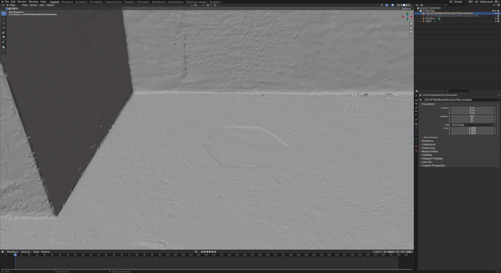

# Optimizing code for Matterport mesh data

## Problem
When scanning 3D indoor scenes and purchasing the mesh data about those scenes from Matterport,
the data is not perfectly completed.

The mesh is separated into multiple patches. There are also some bumpy artifacts due to the inconsistent depth. To apply the proper geometry processing algorithm or to fix those artifacts by hand, post-processing is pre-required, which is smoothing and merging.

## The role of this code
These python codes do a little job to simply correct the bumpy artifacts of an indoor mesh by applying smoothing per patch, then merging the patches into one integrated mesh, utilizing blender python api.

## The result
| before  | after  |
|:-:|:-:|
|   |   |

## Internal Sample Data (CGLAB NAS)
http://gofile.me/4lKC1/IXTpxJtKL