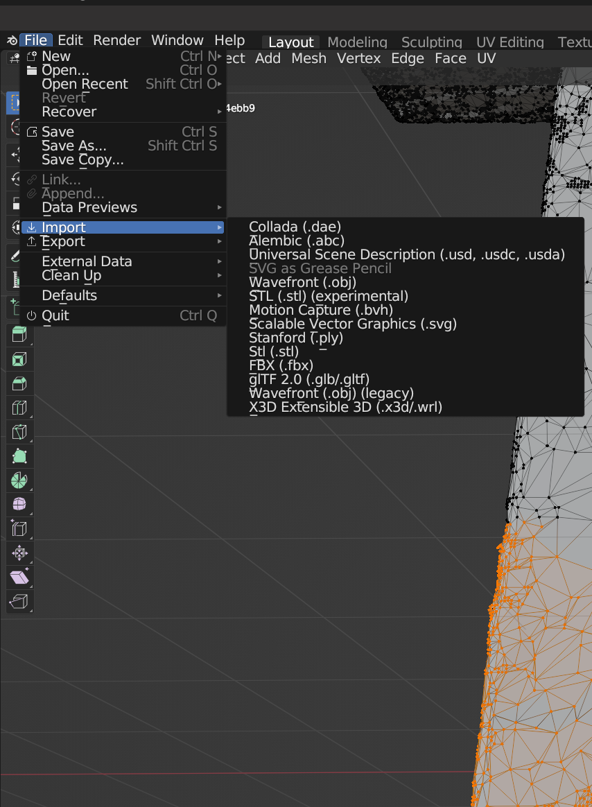
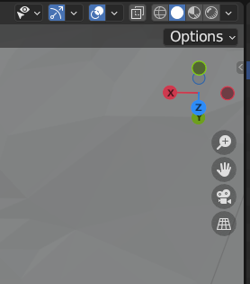
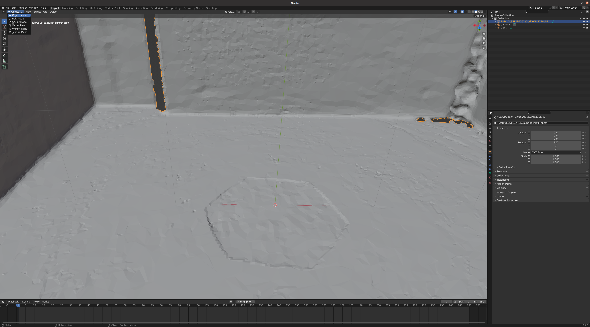
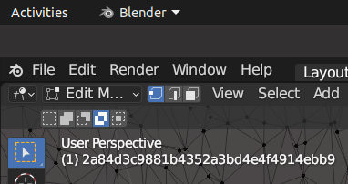
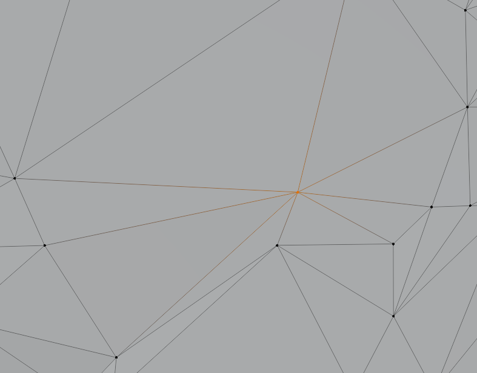
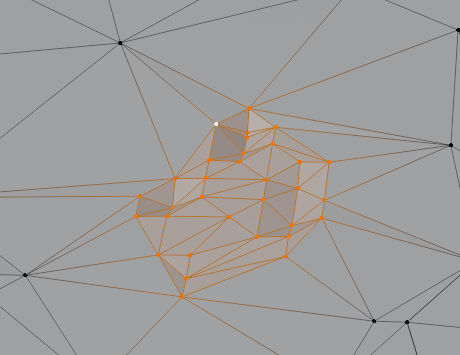
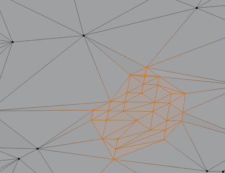

# 튜토리얼 

## XR 트윈 프로젝트 목표

- 실제 미술공간을 스캔하여 실제 미술공간과 동일한 가상공간을 제작하여 
미술관 전시(동선, 미술품 추천)를 시뮬레이션해보고 고품질로 렌더링하여 시각적으로 확인하는 것을 목표로 함

### XR 트윈 저작도구 개발 파이프라인 (CGLAB 입장에서)
  1. 미술관 내 전시관을 3D 스캐너 (matterport, ipad)로 스캔
  2. 3D 스캐너로 취득한 데이터를 mesh 로 변환
  3. 저작도구와 렌더링에 적합하도록 mesh 최적화 algorithm 적용 (코드 실행)
  4. **씬 구성단계 (수작업)** 
     1. 최적화되지 않은 부분을 blender로 수정
     2. 연구실 내부나 kaist (저작도구 개발) 측의 요구사항에 맞춰 blender로 수정

## **blender로 XR트윈 씬을 구성하기 (.blender 파일 만들기)**

- Unity에서 blender 파일 임포트하여 저작도구 및 렌더링에 사용하게 할 수 있도록 하는 일 

### 메쉬 최적화의 목표
  1. 저작도구 및 렌더링에서 활용하기에 적합한 메쉬 만들기
  2. 연구실 내부 혹은 kaist 측의 요구사항 맞추기
   
### Blender 시작하기
  1. Scene import
     1. 좌측상단의 File 탭 사용
    
        
  2. View Camera
     1. 우측상단의 패널에서 조정 가능   
     2. 최상단 우측의 원형 패널: 
        1. wireframe, non-texture, texture, rendering
     3. 하단의 x,y,z: 카메라 컨트롤러
    
   
  3. Object mode
    
     1. 단축키: tab으로 Object mode - Edit mode 토글
     2. blender에서 collection에 포함된 object 단위의 변경 및 수정을 하는 모드
     3. modifier: object 단위의 알고리즘 적용
   
  4. Edit mode
    
     1. 단축키
        1. tab으로 Object mode - Edit mode 토글
        2. 숫자키 1, 2, 3으로 vertex, edge, face, edit 모드 변경
     2. object 내부의 vertex, edge, face를 수정하기 위해 들어가는 window 창
     3. 현 작업에서 가장 빈번하게 사용함
     4. view 버튼 좌측의 3개의 모양 버튼으로 vertex, edge, face 수정을 선택
    

### 주로 사용하는 기능

- Translation, Scale, Rotation
  - 기본

- Merge (가능한 edit: vertex, edge, face)
  - 단축키: element 선택 후, keyboard m
  - 선택한 vertex, edge, face들을 하나로 만드는 operation, 보통 vertex에 대해 사용하는게 편함
  - 
| before  | after  |
|:-:|:-:|
|   |   |

- Smoothing (가능한 edit: vertex)
  - 선택한 local vertex 영역에 대해 vertex position들의 mean 값으로 vertex 들을 움직임
  - 결과적으로 부드러운 vertex connection을 만듬
  - 부분적으로 평탄화시킬 때, mesh에서 vertex가 noise로 나올 때 사용

| before  | after  |
|:-:|:-:|
|   |   |

- Shifting (가능한 edit: vertex, edge, face)
  

